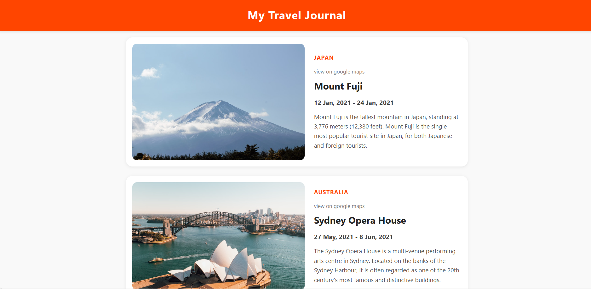

# 🌍 Travel Journal (React + Vite)

A responsive travel journal web app built with **React** and **Vite**.  
Displays a list of travel destinations dynamically from a data file, with clean, card-based UI and mobile-friendly design.

---

## 🚀 Live Demo
[🔗 View Project Here](https://your-deployment-link.com)  

---

## 📸 Screenshot
  

---

## ✨ Features
- 📖 **Dynamic Rendering** – Uses React `.map()` to render multiple travel cards.
- 🎨 **Modern UI** – Clean card design with hover effects, shadows, and rounded corners.
- 📱 **Responsive Design** – Works perfectly on mobile, tablet, and desktop.
- 🔗 **Google Maps Links** – Each card links to the destination on Google Maps.
- ⚡ **Fast Build Tool** – Powered by [Vite](https://vitejs.dev) for lightning-fast development.

---

## 🛠 Tech Stack
- **Frontend:** React (Vite), JavaScript (ES6), HTML5, CSS3 (Flexbox)
- **Tools:** Git, GitHub
- **Deployment:** Netlify / Vercel / GitHub Pages

---

## 🖥️ Installation & Setup
Clone this repository and run the project locally:

```bash
# 1️⃣ Clone repository
git clone https://github.com/YOUR_USERNAME/travel-journal.git

# 2️⃣ Go into the project folder
cd travel-journal

# 3️⃣ Install dependencies
npm install

# 4️⃣ Run the project
npm run dev
